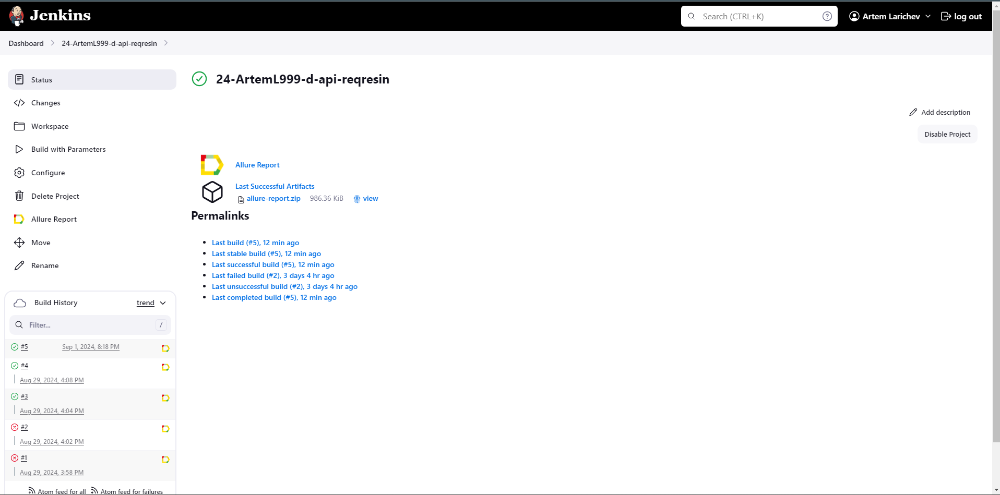
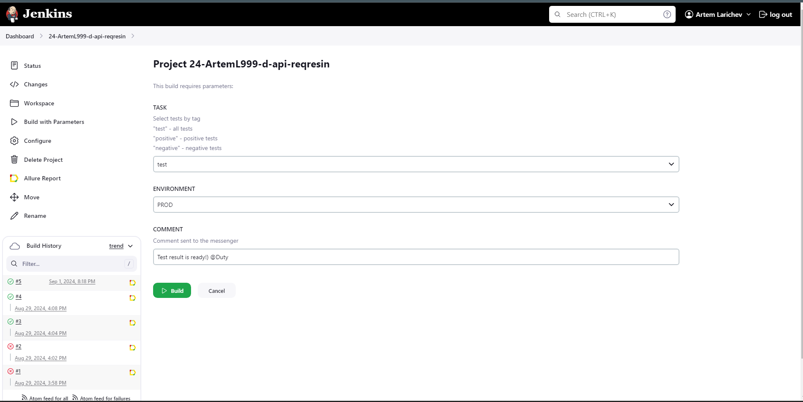
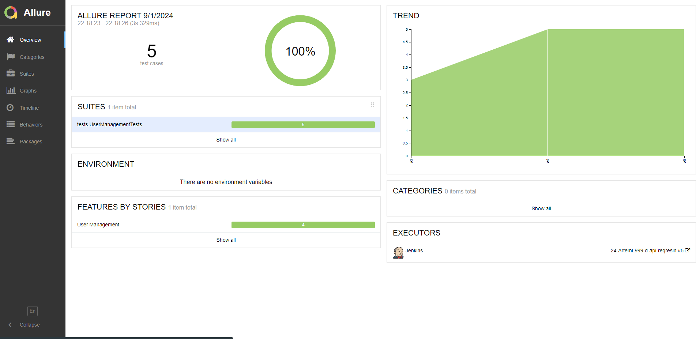
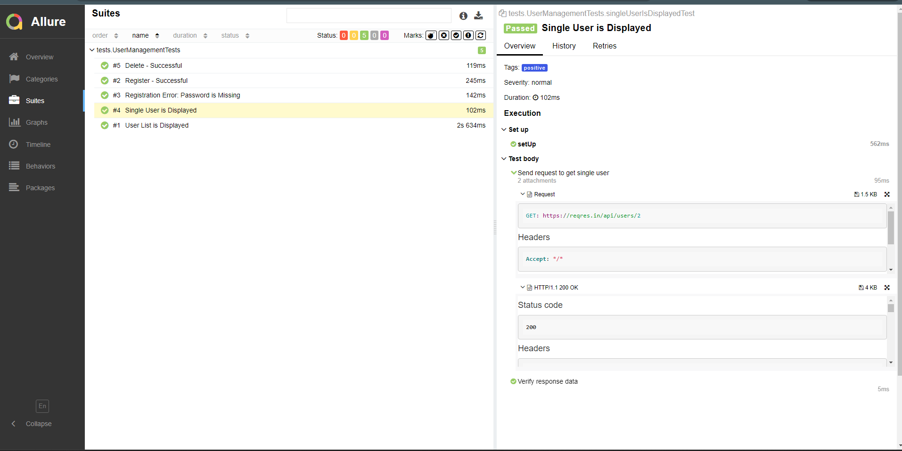
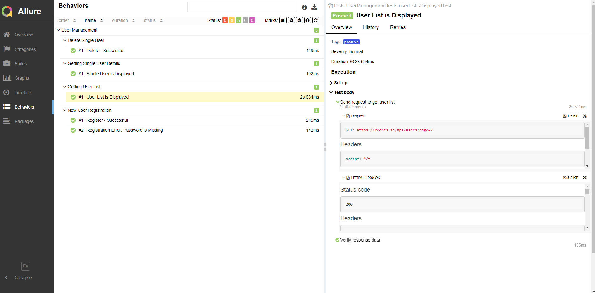
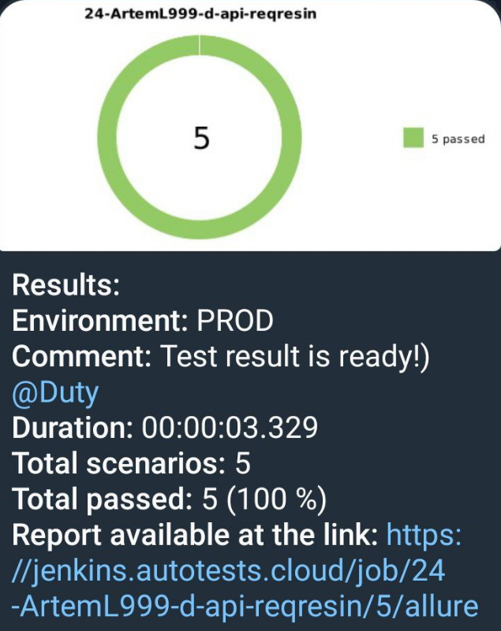

# The project for automating API testing for a website <a href="https://reqres.in/">reqres.in</a>

<p align="center">
<a href="https://reqres.in/"></a>
</p>

## :scroll: Content:

- [Tools used](#computer-Tools-used)
- [Covered functionality](#male_detective-Covered-functionality)
- [Local test execution](#arrow_forward-Local-test-execution)
- [Build in Jenkins](#-Build-in-Jenkins)
- [Example of an Allure report.](#-Example-of-an-Allure-report)
- [Notifications in Telegram using a bot](#-Notifications-in-Telegram-using-a-bot)

## :computer: Tools used

<p align="center">
<a href="https://www.jetbrains.com/idea/"></a> 
<a href="https://www.java.com/"></a> 
<a href="https://gradle.org/"></a>
<a href="https://rest-assured.io/"></a> 
<a href="https://github.com/allure-framework/allure2"></a> 
<a href="https://junit.org/junit5/"></a> 
<a href="https://assertj.github.io/doc/"></a> 
<a href="https://github.com/"></a> 
<a href="https://www.jenkins.io/"></a> 
<a href="https://telegram.org/"></a> 
</p>

The tests in the project are written in <code>Java</code> using  [REST Assured](https://rest-assured.io/) and the <code>Gradle</code> build tool.
<code>JUnit 5</code> is used as the unit testing framework. 
For remote execution, a build is implemented in <code>Jenkins</code> with the generation of an Allure report and sending results to <code>Telegram</code> via a bot.
## :male_detective: Covered functionality

Reqres is a website that provides public access to a test API, which can be used during the development of your own applications
or as a practice tool for working with REST APIs. <br>The tests in the project cover the following functions of the test API:

* Successful registration a user
* Unsuccessful registration a user
* Retrieving user data
* Retrieving the list of users
* Deleting a user (since the practice tool does not actually modify the user list, only the returned 204 status code is checked)

## :arrow_forward: Local test execution

### Console commands to run

Run all tests:
```
gradle clean test
```

Run positive tests:
```
gradle clean positive
```

Run negative tests:
```
gradle clean negative 
```

##  [Build ](https://jenkins.autotests.cloud/job/24-ArtemL999-d-api-reqresin/) in Jenkins

To start the build, you need to click the <code>Build with Parameters</code> button.
<p align="center">

</p>

Next, a window will open for selecting the parameters of the build.

<p align="center">

</p>

After the build is completed, in the <code>Build History</code> section, an <code>Allure Report</code> icon will appear next to the build number. Clicking on it will open a page with the generated HTML report.

##  [Example](https://jenkins.autotests.cloud/job/24-ArtemL999-d-api-reqresin/5/allure/) of an Allure report.

<p align="center">

</p>

### Contents of the Allure report:

* Test cases, organized into folders by suites or features
* Description of test steps
* Requests sent to the API
* Received responses to the requests

### Section: Suites of the Allure Report

<p align="center">

</p>

### Section: Behaviors of the Allure Report

<p align="center">

</p>


##  Notifications in Telegram using a bot

After the build is completed, a special bot created in <code>Telegram</code> receives information from Jenkins and sends a message with the test run report.

<p align="center">

</p>
